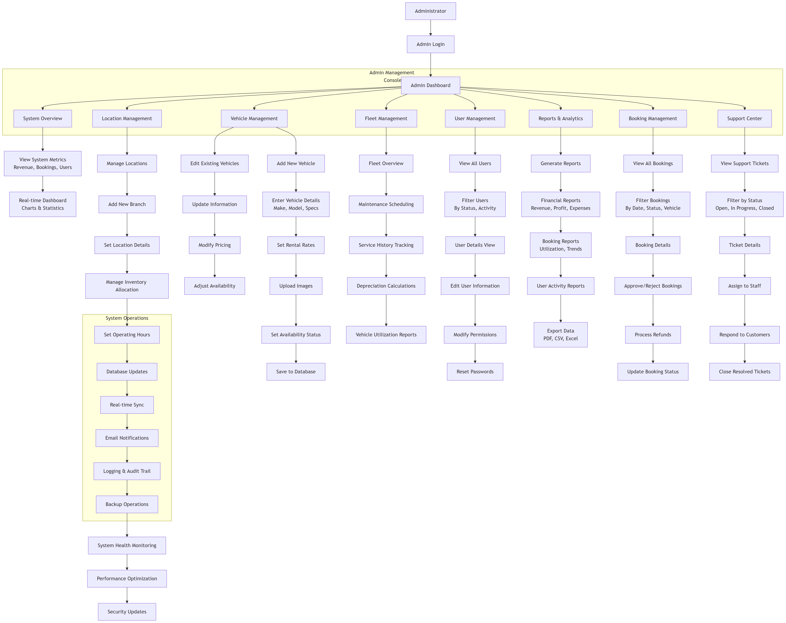
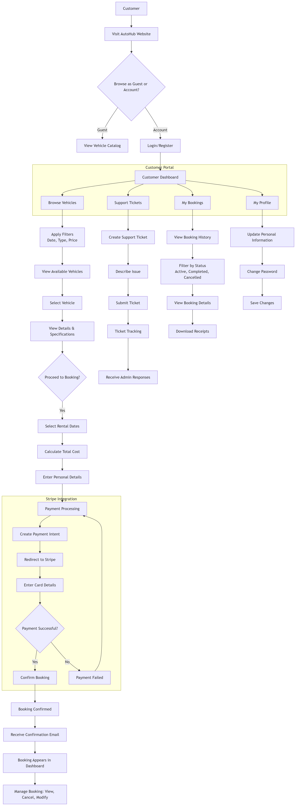

# AutoHub - Vehicle Rental Management System

  
  
  
  
  
  

Welcome to AutoHub - A comprehensive vehicle rental management system featuring a modern React frontend and a robust NestJS backend.

## 📋 Table of Contents

- [System Overview](#-system-overview)
- [System Features](#-system-features)
- [Technologies](#-technologies)
- [System Workflows](#-system-workflows)
- [License](#-license)

## 🏢 System Overview

AutoHub is a full-stack application designed to efficiently manage vehicle rentals. The system provides an intuitive interface for customers to browse vehicles, make bookings, and manage rentals, while offering powerful administrative tools for fleet management, user administration, and business analytics.

The application consists of two main parts:
- **Frontend**: React-based client application with TypeScript and TanStack Router
- **Backend**: NestJS-based RESTful API with PostgreSQL database

## ✨ System Features

### Customer Portal

#### Vehicle Management
- **Interactive Vehicle Catalog**: Browse vehicles with high-quality images and detailed specifications
- **Advanced Filtering System**: Filter vehicles by type, manufacturer, model, price range, features, and availability
- **Vehicle Comparison**: Compare multiple vehicles side by side to make informed decisions
- **Availability Calendar**: Real-time vehicle availability displayed in an interactive calendar
- **Vehicle Reviews**: Customer reviews and ratings for each vehicle

#### Booking System
- **Streamlined Booking Process**: Easy-to-use booking wizard with step-by-step guidance
- **Flexible Date Selection**: Interactive date picker with availability highlighting
- **Multiple Location Support**: Options for pickup and drop-off at different locations
- **Add-on Services**: Selection of additional services (insurance, GPS, child seats, etc.)
- **Real-time Pricing**: Dynamic pricing calculation based on duration and selected options

#### User Account Management
- **Personalized User Dashboard**: Overview of past, current, and upcoming bookings
- **Profile Management**: Update personal information, preferences, and payment methods
- **Booking History**: Complete history with detailed information on past rentals
- **Document Storage**: Upload and store driving licenses and identification documents
- **Favorites System**: Save favorite vehicles for quick access in future visits

#### Payment Processing
- **Secure Payment Gateway**: PCI-compliant payment processing through Stripe
- **Multiple Payment Options**: Credit/debit cards, digital wallets, and direct bank transfers
- **Booking Deposit System**: Option for partial payment with security deposit
- **Digital Receipts**: Automated email receipts for all transactions
- **Flexible Cancellation**: Tiered cancellation policy with automatic refund processing

#### Customer Support
- **In-app Support Chat**: Real-time assistance through integrated chat system
- **Support Ticket System**: Create and track support requests
- **FAQ Knowledge Base**: Comprehensive self-service support resources
- **Notification System**: SMS and email alerts for booking confirmations, reminders, and changes
- **Feedback Mechanism**: Post-rental surveys to gather customer feedback

### Administration Portal

#### Dashboard & Analytics
- **Business Intelligence Dashboard**: Real-time overview of key performance metrics
- **Booking Analytics**: Detailed booking patterns, trends, and forecasts
- **Revenue Reports**: Comprehensive financial reporting with breakdown by vehicle type, location, and time period
- **Fleet Utilization Metrics**: Analytics on vehicle usage, idle time, and optimization opportunities
- **Customer Insights**: User behavior analysis and demographic reporting

#### Vehicle Fleet Management
- **Centralized Inventory Control**: Complete fleet management with status tracking
- **Maintenance Scheduling**: Automated maintenance reminders based on mileage or time intervals
- **Vehicle Lifecycle Management**: Track acquisition, depreciation, and disposal
- **Cost Analysis**: Monitor operating costs, maintenance expenses, and revenue per vehicle
- **Location Management**: Track and manage vehicles across multiple locations

#### Reservation Management
- **Comprehensive Booking Overview**: All reservations with filtering and search capabilities
- **Calendar View**: Visual booking calendar with drag-and-drop functionality
- **Conflict Resolution**: Tools to identify and resolve booking conflicts
- **Bulk Operations**: Process multiple bookings simultaneously
- **Custom Pricing Rules**: Set special rates, discounts, and seasonal pricing

#### User Administration
- **User Management Console**: Manage customer accounts and staff permissions
- **Role-based Access Control**: Granular permission settings for different staff roles
- **User Verification System**: ID verification workflow for new customers
- **Activity Logging**: Track user and admin actions for security and auditing
- **Customer Communication Tools**: Direct messaging and email templates

#### Financial Operations
- **Automated Billing System**: Generate invoices and process payments automatically
- **Revenue Management**: Tools for optimizing pricing and maximizing revenue
- **Expense Tracking**: Monitor operational costs and vendor payments
- **Financial Reporting**: Generate detailed financial statements and tax reports
- **Accounting Integration**: Connect with popular accounting software

#### System Configuration
- **White-label Customization**: Brand customization options for franchise operations
- **Email Template Editor**: Customize all system email communications
- **Policy Management**: Configure rental policies, terms, and conditions
- **Multi-language Support**: Localization options for international operations
- **System Backup**: Automated backup and recovery procedures

## 🔧 Technologies

### Frontend
- React 18.x with TypeScript
- TanStack Router for type-safe routing
- Vite for fast development and building
- Redux Toolkit with RTK Query for state management
- Tailwind CSS for styling
- React Hook Form with Zod validation

### Backend
- NestJS 10.x with TypeScript
- PostgreSQL with TypeORM for database management
- JWT for authentication and authorization
- Stripe for payment processing
- NodeMailer for email notifications
- Swagger/OpenAPI for API documentation

## 📄 License

This project is licensed under the MIT License - see the LICENSE file for details.

---

AutoHub - A comprehensive vehicle rental management system with React frontend and NestJS backend.

## 📊 System Workflows

### Admin User Flow

*This diagram illustrates the administrative user journey, showing the key interactions and processes for system administrators.*

### Customer User Flow

*This diagram shows the complete customer journey from registration to booking completion, highlighting the intuitive user experience.*
